# Principal Component Analysis (PCA)


```
## **Results for the Principal Component Analysis (PCA)**
## The analysis was performed on 452930 individuals, described by 36 variables
## *The results are available in the following objects:
## 
##    name               description                          
## 1  "$eig"             "eigenvalues"                        
## 2  "$var"             "results for the variables"          
## 3  "$var$coord"       "coord. for the variables"           
## 4  "$var$cor"         "correlations variables - dimensions"
## 5  "$var$cos2"        "cos2 for the variables"             
## 6  "$var$contrib"     "contributions of the variables"     
## 7  "$ind"             "results for the individuals"        
## 8  "$ind$coord"       "coord. for the individuals"         
## 9  "$ind$cos2"        "cos2 for the individuals"           
## 10 "$ind$contrib"     "contributions of the individuals"   
## 11 "$call"            "summary statistics"                 
## 12 "$call$centre"     "mean of the variables"              
## 13 "$call$ecart.type" "standard error of the variables"    
## 14 "$call$row.w"      "weights for the individuals"        
## 15 "$call$col.w"      "weights for the variables"
```

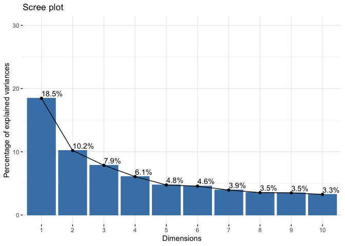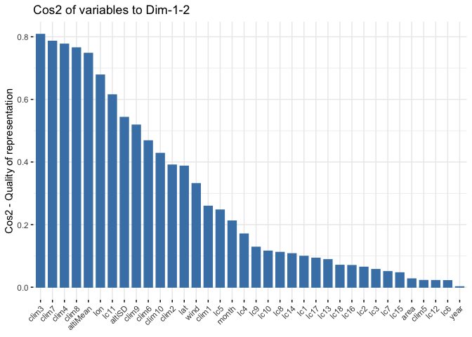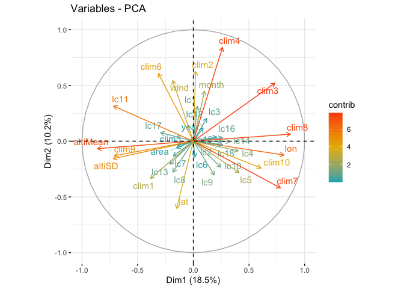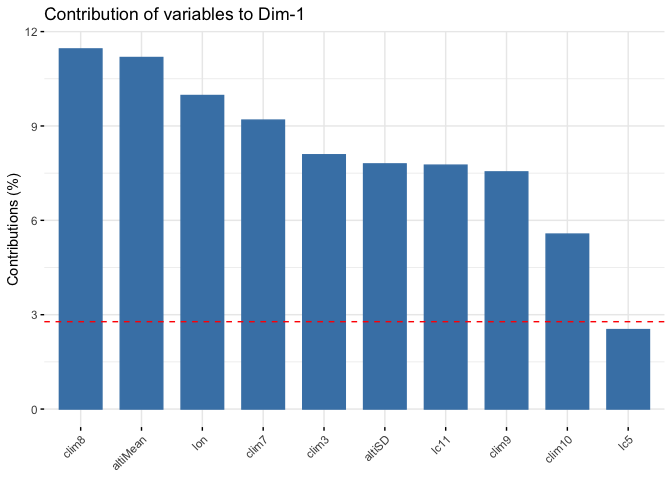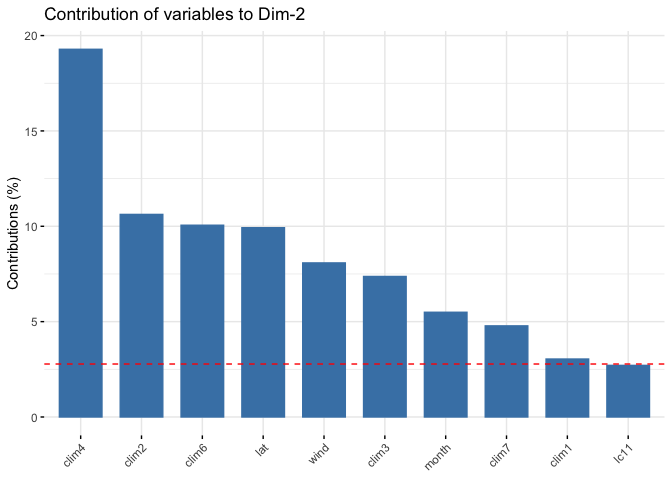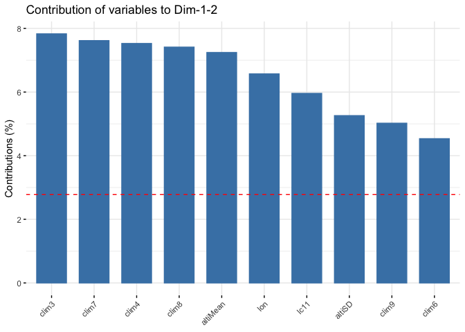


#-------------------------------------------------------------------------------


# CNT Models

## Benchmark Model : GLM Poisson Log


```
## 
## Call:
## glm(formula = CNT ~ . - BA - wind - RH, family = poisson(link = "log"), 
##     data = train)
## 
## Deviance Residuals: 
##     Min       1Q   Median       3Q      Max  
## -10.515   -1.585   -1.007   -0.178   40.947  
## 
## Coefficients:
##               Estimate Std. Error z value Pr(>|z|)    
## (Intercept) 11.8503514  0.6510229  18.203  < 2e-16 ***
## lon          0.0274452  0.0003682  74.544  < 2e-16 ***
## lat         -0.0256447  0.0009108 -28.156  < 2e-16 ***
## area         0.6033917  0.0278493  21.666  < 2e-16 ***
## year        -0.0040509  0.0003253 -12.451  < 2e-16 ***
## month       -0.0641442  0.0030668 -20.916  < 2e-16 ***
## lc1          0.1357770  0.0094489  14.370  < 2e-16 ***
## lc2          1.2977666  0.0875117  14.830  < 2e-16 ***
## lc3          0.0892332  0.0070746  12.613  < 2e-16 ***
## lc4          0.4185721  0.0206009  20.318  < 2e-16 ***
## lc5          1.2077387  0.0597657  20.208  < 2e-16 ***
## lc6          0.0156822  0.0042138   3.722 0.000198 ***
## lc7          1.5641241  0.0701501  22.297  < 2e-16 ***
## lc8          0.6539978  0.0281413  23.240  < 2e-16 ***
## lc9          0.3729705  0.0247742  15.055  < 2e-16 ***
## lc10         0.2113665  0.0068406  30.899  < 2e-16 ***
## lc11         1.2166058  0.1023197  11.890  < 2e-16 ***
## lc12         1.4654506  0.0807321  18.152  < 2e-16 ***
## lc13         0.0679871  0.0049606  13.705  < 2e-16 ***
## lc14         0.3452503  0.0168864  20.445  < 2e-16 ***
## lc15         0.2630808  0.0110640  23.778  < 2e-16 ***
## lc16         0.3917898  0.0124638  31.434  < 2e-16 ***
## lc17        -0.0258947  0.0156277  -1.657 0.097525 .  
## lc18         0.9415750  0.0607323  15.504  < 2e-16 ***
## altiMean     0.4511399  0.0393054  11.478  < 2e-16 ***
## altiSD       0.1597044  0.0041676  38.321  < 2e-16 ***
## clim1       -0.0513928  0.0036433 -14.106  < 2e-16 ***
## clim2       -0.0958056  0.0035994 -26.617  < 2e-16 ***
## clim3       -0.4536980  0.0158247 -28.670  < 2e-16 ***
## clim4        0.2918875  0.0140029  20.845  < 2e-16 ***
## clim5       -0.0974454  0.0039880 -24.435  < 2e-16 ***
## clim6        0.3292806  0.0066597  49.443  < 2e-16 ***
## clim7       -0.5560202  0.0115367 -48.196  < 2e-16 ***
## clim8        1.0922276  0.0406048  26.899  < 2e-16 ***
## clim9        0.3878491  0.0060278  64.344  < 2e-16 ***
## clim10      -0.0161508  0.0041313  -3.909 9.25e-05 ***
## ---
## Signif. codes:  0 '***' 0.001 '**' 0.01 '*' 0.05 '.' 0.1 ' ' 1
## 
## (Dispersion parameter for poisson family taken to be 1)
## 
##     Null deviance: 536292  on 73562  degrees of freedom
## Residual deviance: 350663  on 73527  degrees of freedom
## AIC: 437093
## 
## Number of Fisher Scoring iterations: 6
```

```
## S_CNT = 6418
```

## GLM Poisson log


```
## 
## Call:
## glm(formula = CNT ~ -1 + factor(month) + wind + altiMean + clim4 + 
##     clim7 + clim8 + clim9 + clim10 + lc7 + lc11 + lc15 + lc16, 
##     family = poisson(link = "log"), data = train)
## 
## Deviance Residuals: 
##     Min       1Q   Median       3Q      Max  
## -13.915   -1.766   -1.261   -0.185   43.422  
## 
## Coefficients:
##                 Estimate Std. Error z value Pr(>|z|)    
## factor(month)3  0.763599   0.009122  83.712   <2e-16 ***
## factor(month)4  0.920589   0.007208 127.724   <2e-16 ***
## factor(month)5  0.496570   0.007570  65.600   <2e-16 ***
## factor(month)6  0.174378   0.008406  20.744   <2e-16 ***
## factor(month)7  0.399887   0.007670  52.138   <2e-16 ***
## factor(month)8  0.196162   0.008041  24.395   <2e-16 ***
## factor(month)9  0.007492   0.008203   0.913    0.361    
## wind           -0.280729   0.003469 -80.932   <2e-16 ***
## altiMean        1.472038   0.032230  45.673   <2e-16 ***
## clim4           0.225873   0.006004  37.618   <2e-16 ***
## clim7          -0.604043   0.006203 -97.372   <2e-16 ***
## clim8           1.943588   0.033318  58.335   <2e-16 ***
## clim9           0.204942   0.004903  41.803   <2e-16 ***
## clim10         -0.159045   0.003852 -41.290   <2e-16 ***
## lc7             0.377779   0.002204 171.418   <2e-16 ***
## lc11           -0.502034   0.005110 -98.244   <2e-16 ***
## lc15            0.058140   0.001921  30.266   <2e-16 ***
## lc16            0.174513   0.001205 144.768   <2e-16 ***
## ---
## Signif. codes:  0 '***' 0.001 '**' 0.01 '*' 0.05 '.' 0.1 ' ' 1
## 
## (Dispersion parameter for poisson family taken to be 1)
## 
##     Null deviance: 616441  on 73563  degrees of freedom
## Residual deviance: 407092  on 73545  degrees of freedom
## AIC: 493486
## 
## Number of Fisher Scoring iterations: 6
```

```
## S_CNT = 6253
```

## Zero Inflated Poisson


```
## 
## Call:
## zeroinfl(formula = CNT ~ . - BA - 1 - year - clim1 - clim2 - lon - lat - 
##     area - altiSD - lc6 - lc17 | 1, data = train)
## 
## Pearson residuals:
##      Min       1Q   Median       3Q      Max 
## -0.92452 -0.71048 -0.55518  0.04704 98.60854 
## 
## Count model coefficients (poisson with log link):
##            Estimate Std. Error z value Pr(>|z|)    
## month     0.1544827  0.0007868 196.351  < 2e-16 ***
## lc1       0.0994669  0.0054923  18.110  < 2e-16 ***
## lc2       1.0012322  0.0377341  26.534  < 2e-16 ***
## lc3       0.0814137  0.0046288  17.588  < 2e-16 ***
## lc4       0.3996794  0.0092143  43.376  < 2e-16 ***
## lc5       1.0883198  0.0259286  41.974  < 2e-16 ***
## lc7       1.2807950  0.0304391  42.077  < 2e-16 ***
## lc8       0.4910069  0.0124606  39.405  < 2e-16 ***
## lc9       0.3658237  0.0110659  33.059  < 2e-16 ***
## lc10      0.1522888  0.0035772  42.573  < 2e-16 ***
## lc11      1.3696239  0.0446405  30.681  < 2e-16 ***
## lc12      1.3653615  0.0347924  39.243  < 2e-16 ***
## lc13      0.0788610  0.0037013  21.306  < 2e-16 ***
## lc14      0.2875736  0.0077102  37.298  < 2e-16 ***
## lc15      0.2260444  0.0050695  44.589  < 2e-16 ***
## lc16      0.3511399  0.0054797  64.080  < 2e-16 ***
## lc18      0.9182421  0.0265107  34.637  < 2e-16 ***
## altiMean  1.7079909  0.0366899  46.552  < 2e-16 ***
## clim3     0.4474226  0.0289313  15.465  < 2e-16 ***
## clim4    -0.9841451  0.0252024 -39.050  < 2e-16 ***
## clim5     0.0622331  0.0043383  14.345  < 2e-16 ***
## clim6     0.3795718  0.0063323  59.942  < 2e-16 ***
## clim7     0.0820471  0.0123236   6.658 2.78e-11 ***
## clim8     2.7095133  0.0380973  71.121  < 2e-16 ***
## clim9     0.0762295  0.0062584  12.180  < 2e-16 ***
## clim10    0.1930376  0.0045898  42.058  < 2e-16 ***
## wind     -0.1245267  0.0042832 -29.074  < 2e-16 ***
## RH       -1.3161170  0.0201273 -65.390  < 2e-16 ***
## 
## Zero-inflation model coefficients (binomial with logit link):
##             Estimate Std. Error z value Pr(>|z|)    
## (Intercept) 0.119811   0.009017   13.29   <2e-16 ***
## ---
## Signif. codes:  0 '***' 0.001 '**' 0.01 '*' 0.05 '.' 0.1 ' ' 1 
## 
## Number of iterations in BFGS optimization: 34 
## Log-likelihood: -1.809e+05 on 29 Df
```

```
## S_CNT = 6876
```


```
## 
## Call:
## zeroinfl(formula = CNT ~ . - BA - 1 - clim1 - clim2 - year - month - 
##     lat - altiSD + factor(month) | 1, data = train)
## 
## Pearson residuals:
##      Min       1Q   Median       3Q      Max 
## -0.90073 -0.70632 -0.57010  0.04549 83.99699 
## 
## Count model coefficients (poisson with log link):
##                  Estimate Std. Error z value Pr(>|z|)    
## lon             0.0247073  0.0003682  67.098  < 2e-16 ***
## area            0.3953026  0.0363112  10.887  < 2e-16 ***
## lc1             0.2009693  0.0093805  21.424  < 2e-16 ***
## lc2             1.6109994  0.0838997  19.201  < 2e-16 ***
## lc3             0.0714023  0.0068707  10.392  < 2e-16 ***
## lc4             0.4647880  0.0198195  23.451  < 2e-16 ***
## lc5             1.3496167  0.0573533  23.532  < 2e-16 ***
## lc6             0.0190581  0.0047819   3.985 6.73e-05 ***
## lc7             1.6065060  0.0672470  23.890  < 2e-16 ***
## lc8             0.6574543  0.0269731  24.374  < 2e-16 ***
## lc9             0.4826110  0.0239062  20.188  < 2e-16 ***
## lc10            0.1886671  0.0066600  28.329  < 2e-16 ***
## lc11            1.7885712  0.0981995  18.214  < 2e-16 ***
## lc12            1.6463652  0.0774071  21.269  < 2e-16 ***
## lc13            0.0736093  0.0049552  14.855  < 2e-16 ***
## lc14            0.3314461  0.0163542  20.267  < 2e-16 ***
## lc15            0.2593861  0.0107155  24.207  < 2e-16 ***
## lc16            0.3992489  0.0119377  33.444  < 2e-16 ***
## lc17            0.1403600  0.0153129   9.166  < 2e-16 ***
## lc18            1.2001751  0.0587222  20.438  < 2e-16 ***
## altiMean        0.1632053  0.0394823   4.134 3.57e-05 ***
## clim3           0.8072149  0.0311165  25.942  < 2e-16 ***
## clim4          -0.7335317  0.0271390 -27.029  < 2e-16 ***
## clim5           0.0792423  0.0044938  17.634  < 2e-16 ***
## clim6           0.7723125  0.0118446  65.204  < 2e-16 ***
## clim7           0.1278711  0.0136468   9.370  < 2e-16 ***
## clim8           0.6541736  0.0419328  15.601  < 2e-16 ***
## clim9           0.3930464  0.0066468  59.133  < 2e-16 ***
## clim10          0.1185048  0.0047003  25.212  < 2e-16 ***
## wind           -0.1246411  0.0041040 -30.370  < 2e-16 ***
## RH             -1.0680437  0.0210883 -50.646  < 2e-16 ***
## factor(month)3  3.8914150  0.0524776  74.154  < 2e-16 ***
## factor(month)4  3.3290160  0.0507759  65.563  < 2e-16 ***
## factor(month)5  2.8161943  0.0512209  54.981  < 2e-16 ***
## factor(month)6  2.5760039  0.0526398  48.936  < 2e-16 ***
## factor(month)7  2.8338692  0.0530960  53.373  < 2e-16 ***
## factor(month)8  2.9336203  0.0536473  54.684  < 2e-16 ***
## factor(month)9  3.2917149  0.0550609  59.783  < 2e-16 ***
## 
## Zero-inflation model coefficients (binomial with logit link):
##             Estimate Std. Error z value Pr(>|z|)    
## (Intercept) 0.178825   0.008842   20.22   <2e-16 ***
## ---
## Signif. codes:  0 '***' 0.001 '**' 0.01 '*' 0.05 '.' 0.1 ' ' 1 
## 
## Number of iterations in BFGS optimization: 43 
## Log-likelihood: -1.706e+05 on 39 Df
```

```
## S_CNT = 6697
```

## GLM m0 Lasso

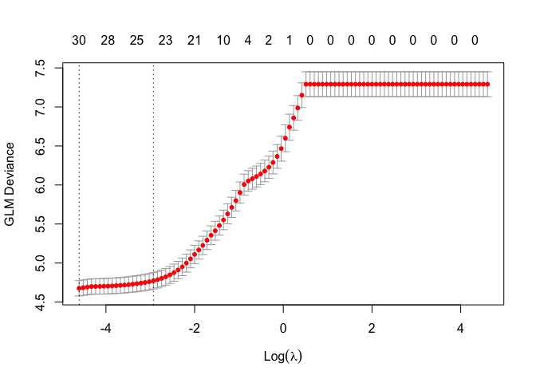

```
## Best Lambda = 0.01
```

```
## 
## S_CNT = 6255
```


#-------------------------------------------------------------------------------


# BA Models

## Benchmark Model : Mixture of m0 and GLM Gaussian Id on logBA


```
## 
## Call:
## glm(formula = log(BA) ~ . - CNT - wind - RH, family = gaussian(), 
##     data = train[train$BA > 0, ])
## 
## Deviance Residuals: 
##      Min        1Q    Median        3Q       Max  
## -10.2514   -1.6683   -0.1261    1.4779   11.3459  
## 
## Coefficients:
##              Estimate Std. Error t value Pr(>|t|)    
## (Intercept) 56.966082   3.886155  14.659  < 2e-16 ***
## lon          0.026441   0.002136  12.377  < 2e-16 ***
## lat         -0.063704   0.004998 -12.746  < 2e-16 ***
## area         0.828160   0.173994   4.760 1.95e-06 ***
## year        -0.024967   0.001936 -12.893  < 2e-16 ***
## month       -0.213025   0.017324 -12.296  < 2e-16 ***
## lc1          0.069662   0.045787   1.521  0.12816    
## lc2         -0.716337   0.402295  -1.781  0.07498 .  
## lc3         -0.008948   0.034017  -0.263  0.79252    
## lc4         -0.283229   0.095703  -2.959  0.00308 ** 
## lc5         -0.552933   0.274885  -2.012  0.04428 *  
## lc6          0.032446   0.018980   1.710  0.08737 .  
## lc7         -0.609126   0.322278  -1.890  0.05876 .  
## lc8         -0.159553   0.129595  -1.231  0.21827    
## lc9         -0.439139   0.115281  -3.809  0.00014 ***
## lc10        -0.102042   0.033591  -3.038  0.00239 ** 
## lc11        -1.495854   0.469602  -3.185  0.00145 ** 
## lc12        -0.449690   0.371092  -1.212  0.22560    
## lc13         0.008780   0.024594   0.357  0.72109    
## lc14        -0.132062   0.079414  -1.663  0.09633 .  
## lc15         0.025325   0.052688   0.481  0.63076    
## lc16        -0.133450   0.059077  -2.259  0.02390 *  
## lc17        -0.427187   0.070010  -6.102 1.06e-09 ***
## lc18        -0.593267   0.282514  -2.100  0.03574 *  
## altiMean    -0.218909   0.206968  -1.058  0.29020    
## altiSD       0.017539   0.024530   0.715  0.47460    
## clim1       -0.117738   0.021343  -5.517 3.49e-08 ***
## clim2       -0.118890   0.019750  -6.020 1.77e-09 ***
## clim3       -0.720545   0.095519  -7.543 4.71e-14 ***
## clim4        0.943075   0.084844  11.115  < 2e-16 ***
## clim5       -0.262086   0.024994 -10.486  < 2e-16 ***
## clim6       -0.055231   0.039439  -1.400  0.16140    
## clim7       -0.519314   0.070454  -7.371 1.74e-13 ***
## clim8        0.341384   0.215206   1.586  0.11268    
## clim9        0.598043   0.037130  16.107  < 2e-16 ***
## clim10      -0.042810   0.023571  -1.816  0.06934 .  
## ---
## Signif. codes:  0 '***' 0.001 '**' 0.01 '*' 0.05 '.' 0.1 ' ' 1
## 
## (Dispersion parameter for gaussian family taken to be 6.022376)
## 
##     Null deviance: 212626  on 28478  degrees of freedom
## Residual deviance: 171294  on 28443  degrees of freedom
## AIC: 131991
## 
## Number of Fisher Scoring iterations: 2
```

```
## S_BA = 3854
```

## Mixture of Random Forest Classifier and GLM Gaussian Id on logBA


```
## 
## Call:
##  randomForest(formula = as.factor(I(BA > 0)) ~ . - 1 - CNT - clim1 -      clim2, data = train) 
##                Type of random forest: classification
##                      Number of trees: 500
## No. of variables tried at each split: 5
## 
##         OOB estimate of  error rate: 16.71%
## Confusion matrix:
##       FALSE  TRUE class.error
## FALSE 40019  5065   0.1123458
## TRUE   7226 21253   0.2537308
```


```
## 
## Call:
## glm(formula = log(BA) ~ . - CNT - clim1 - clim2, family = gaussian(), 
##     data = train[train$BA > 0, ])
## 
## Deviance Residuals: 
##     Min       1Q   Median       3Q      Max  
## -9.6664  -1.6276  -0.1146   1.4485  11.2574  
## 
## Coefficients:
##              Estimate Std. Error t value Pr(>|t|)    
## (Intercept) 63.854673   3.880714  16.454  < 2e-16 ***
## lon          0.021653   0.002127  10.181  < 2e-16 ***
## lat         -0.065096   0.005027 -12.949  < 2e-16 ***
## area         0.778685   0.173142   4.497 6.91e-06 ***
## year        -0.028568   0.001936 -14.753  < 2e-16 ***
## month       -0.228775   0.017196 -13.304  < 2e-16 ***
## lc1          0.100334   0.045352   2.212  0.02695 *  
## lc2         -0.723020   0.398729  -1.813  0.06979 .  
## lc3         -0.045164   0.033718  -1.339  0.18043    
## lc4         -0.248046   0.094910  -2.613  0.00897 ** 
## lc5         -0.421280   0.272443  -1.546  0.12204    
## lc6          0.023393   0.018805   1.244  0.21351    
## lc7         -0.490800   0.319434  -1.536  0.12444    
## lc8         -0.127950   0.128355  -0.997  0.31885    
## lc9         -0.352052   0.114353  -3.079  0.00208 ** 
## lc10        -0.069087   0.033363  -2.071  0.03839 *  
## lc11        -1.387663   0.465585  -2.980  0.00288 ** 
## lc12        -0.442475   0.367791  -1.203  0.22896    
## lc13         0.016137   0.024383   0.662  0.50811    
## lc14        -0.106995   0.078731  -1.359  0.17416    
## lc15         0.030144   0.052218   0.577  0.56377    
## lc16        -0.140973   0.058481  -2.411  0.01593 *  
## lc17        -0.409944   0.069419  -5.905 3.56e-09 ***
## lc18        -0.361180   0.280212  -1.289  0.19743    
## altiMean    -0.106280   0.205943  -0.516  0.60581    
## altiSD       0.021615   0.024728   0.874  0.38208    
## clim3        1.770743   0.155776  11.367  < 2e-16 ***
## clim4       -1.147532   0.130887  -8.767  < 2e-16 ***
## clim5       -0.054750   0.026575  -2.060  0.03939 *  
## clim6        0.037234   0.040057   0.930  0.35263    
## clim7       -0.100858   0.071348  -1.414  0.15749    
## clim8        0.615158   0.214375   2.870  0.00411 ** 
## clim9        0.716913   0.037299  19.221  < 2e-16 ***
## clim10       0.114769   0.024871   4.614 3.96e-06 ***
## wind        -0.186820   0.020731  -9.011  < 2e-16 ***
## RH          -2.100618   0.105403 -19.929  < 2e-16 ***
## ---
## Signif. codes:  0 '***' 0.001 '**' 0.01 '*' 0.05 '.' 0.1 ' ' 1
## 
## (Dispersion parameter for gaussian family taken to be 5.928489)
## 
##     Null deviance: 212626  on 28478  degrees of freedom
## Residual deviance: 168624  on 28443  degrees of freedom
## AIC: 131544
## 
## Number of Fisher Scoring iterations: 2
```

```
## S_BA = 3813
```

## GLM Gaussian Id on log(BA+1)
Tested it on 80k -> better than benchmark with a score of 3932 (about rank 4)


```
## 
## Call:
## glm(formula = log1p(BA) ~ . - 1 - CNT - clim1 - clim2 - lc6 - 
##     clim6 - lc10 - clim8, family = gaussian(), data = train)
## 
## Deviance Residuals: 
##     Min       1Q   Median       3Q      Max  
## -3.6302  -0.8950  -0.3869   0.3046  11.0264  
## 
## Coefficients:
##            Estimate Std. Error t value Pr(>|t|)    
## lon       1.006e-02  8.771e-04  11.469  < 2e-16 ***
## lat      -1.942e-02  1.803e-03 -10.769  < 2e-16 ***
## area      5.287e-01  4.579e-02  11.544  < 2e-16 ***
## year      1.348e-03  4.803e-05  28.075  < 2e-16 ***
## month    -9.627e-02  5.740e-03 -16.774  < 2e-16 ***
## lc1      -6.068e-02  1.073e-02  -5.654 1.58e-08 ***
## lc2      -1.018e+00  8.259e-02 -12.330  < 2e-16 ***
## lc3      -6.324e-02  9.549e-03  -6.623 3.55e-11 ***
## lc4      -2.467e-01  2.008e-02 -12.283  < 2e-16 ***
## lc5      -5.771e-01  5.744e-02 -10.046  < 2e-16 ***
## lc7      -4.886e-01  6.771e-02  -7.216 5.39e-13 ***
## lc8      -2.424e-01  2.840e-02  -8.536  < 2e-16 ***
## lc9      -3.283e-01  2.460e-02 -13.344  < 2e-16 ***
## lc11     -1.342e+00  9.876e-02 -13.587  < 2e-16 ***
## lc12     -8.204e-01  7.766e-02 -10.565  < 2e-16 ***
## lc13     -3.451e-02  8.523e-03  -4.049 5.16e-05 ***
## lc14     -1.239e-01  1.693e-02  -7.320 2.50e-13 ***
## lc15     -8.194e-03  1.185e-02  -0.692 0.489121    
## lc16     -1.089e-01  1.494e-02  -7.290 3.12e-13 ***
## lc17     -2.759e-01  1.501e-02 -18.380  < 2e-16 ***
## lc18     -5.849e-01  5.767e-02 -10.142  < 2e-16 ***
## altiMean -4.233e-01  1.251e-02 -33.837  < 2e-16 ***
## altiSD    9.484e-02  1.036e-02   9.152  < 2e-16 ***
## clim3     8.615e-01  6.044e-02  14.254  < 2e-16 ***
## clim4    -6.017e-01  5.120e-02 -11.752  < 2e-16 ***
## clim5    -1.784e-01  1.098e-02 -16.242  < 2e-16 ***
## clim7    -3.089e-01  2.582e-02 -11.967  < 2e-16 ***
## clim9     2.881e-01  1.196e-02  24.094  < 2e-16 ***
## clim10    3.108e-02  8.852e-03   3.510 0.000448 ***
## wind     -1.061e-01  6.905e-03 -15.368  < 2e-16 ***
## RH       -8.627e-01  3.846e-02 -22.430  < 2e-16 ***
## ---
## Signif. codes:  0 '***' 0.001 '**' 0.01 '*' 0.05 '.' 0.1 ' ' 1
## 
## (Dispersion parameter for gaussian family taken to be 2.338239)
## 
##     Null deviance: 267648  on 73563  degrees of freedom
## Residual deviance: 171935  on 73532  degrees of freedom
## AIC: 271280
## 
## Number of Fisher Scoring iterations: 2
```

```
## S_BA = 3727
```

## GAM Gaussian Id on log(BA+1) 
3923 full data


```
## 
## Family: gaussian 
## Link function: identity 
## 
## Formula:
## log1p(BA) ~ -1 + year + month + s(lon, lat, bs = "gp", k = 100) + 
##     s(area, bs = "cr", k = 12) + s(altiMean, bs = "cr", k = 20) + 
##     s(wind, bs = "cr", k = 12) + s(RH, bs = "cr", k = 12) + s(clim4, 
##     bs = "cc", k = 7) + ti(lc11, wind, k = 12) + ti(lc12, wind, 
##     k = 12) + ti(lc1, wind, k = 12) + ti(lc7, wind, k = 12) + 
##     ti(lc14, wind, k = 12) + s(lc18, bs = "cr", k = 30)
## 
## Parametric coefficients:
##         Estimate Std. Error t value Pr(>|t|)    
## year   4.899e-04  1.416e-05   34.61  < 2e-16 ***
## month -2.112e-02  4.590e-03   -4.60 4.22e-06 ***
## ---
## Signif. codes:  0 '***' 0.001 '**' 0.01 '*' 0.05 '.' 0.1 ' ' 1
## 
## Approximate significance of smooth terms:
##                  edf Ref.df       F p-value    
## s(lon,lat)    93.384 96.144  83.988  <2e-16 ***
## s(area)        7.337  8.661  15.125  <2e-16 ***
## s(altiMean)   18.192 18.820  18.712  <2e-16 ***
## s(wind)        2.158  2.694 113.499  <2e-16 ***
## s(RH)          7.834  8.979 895.191  <2e-16 ***
## s(clim4)       4.053  5.000  25.988  <2e-16 ***
## ti(lc11,wind) 19.301 24.481   7.031  <2e-16 ***
## ti(lc12,wind) 19.108 25.451   5.930  <2e-16 ***
## ti(lc1,wind)  16.175 20.758   7.163  <2e-16 ***
## ti(lc7,wind)  17.012 23.061   8.924  <2e-16 ***
## ti(lc14,wind) 10.223 13.449   5.376  <2e-16 ***
## s(lc18)       14.719 16.290  14.941  <2e-16 ***
## ---
## Signif. codes:  0 '***' 0.001 '**' 0.01 '*' 0.05 '.' 0.1 ' ' 1
## 
## R-sq.(adj) =  0.225   Deviance explained = 22.7%
## fREML = 1.3434e+05  Scale est. = 2.2291    n = 73563
```

```
## S_BA = 3714
```

```
## 
## 
## Time to fit the model : 2.969
```

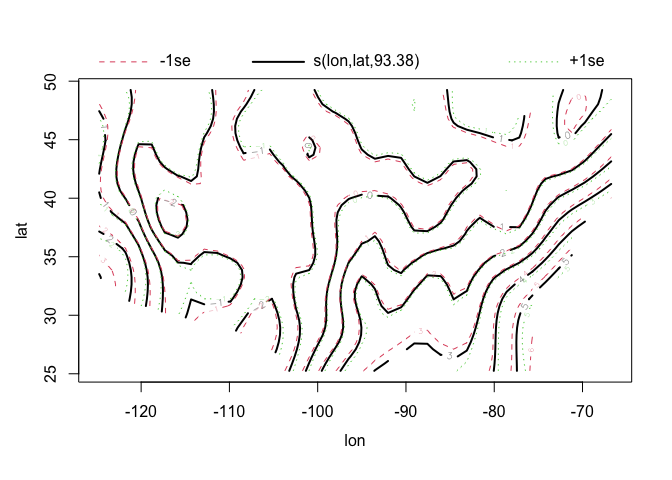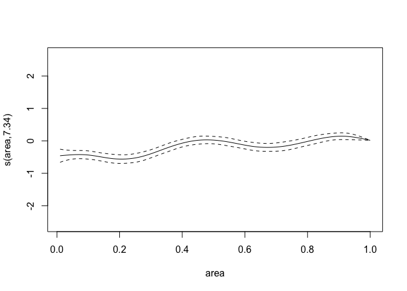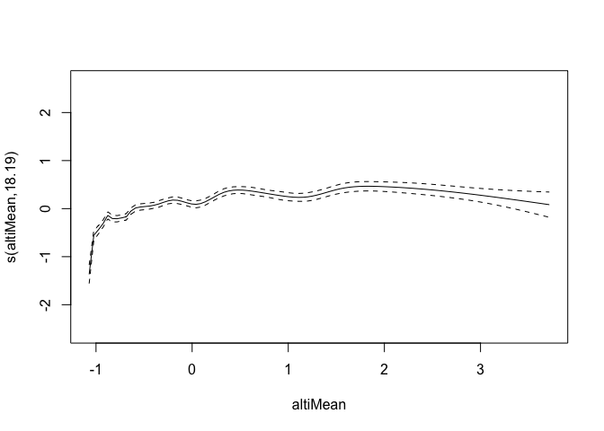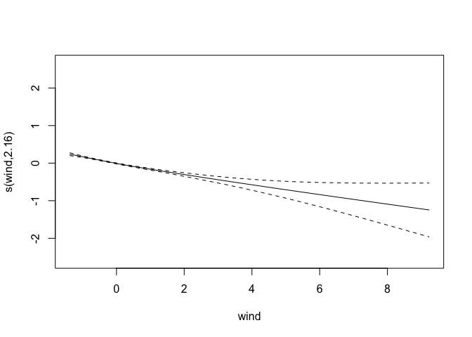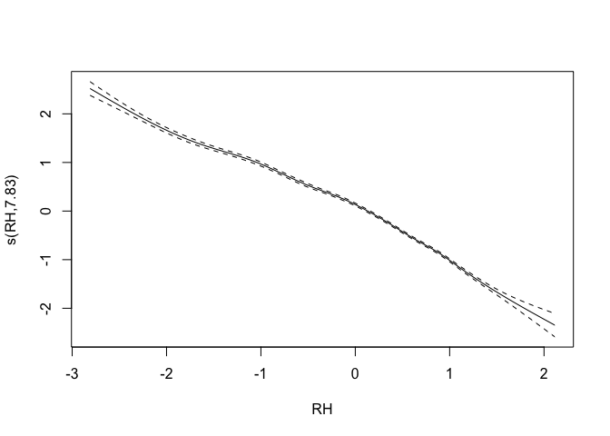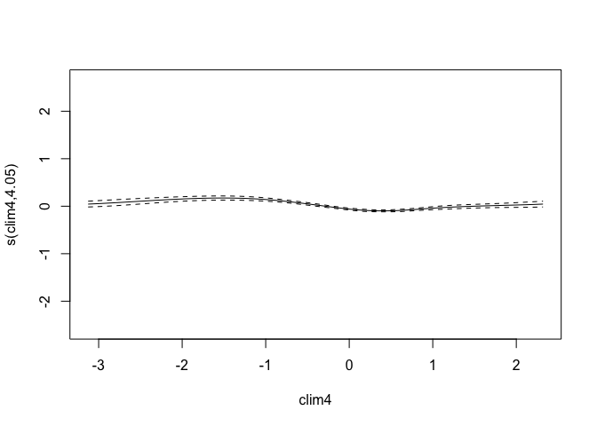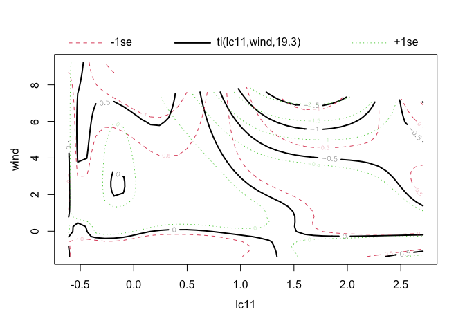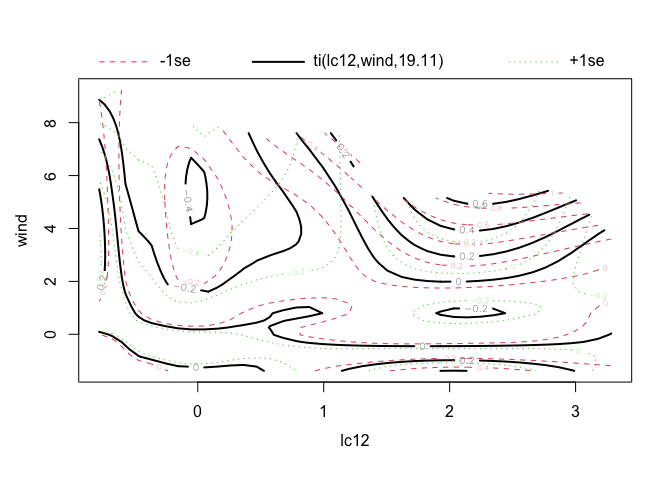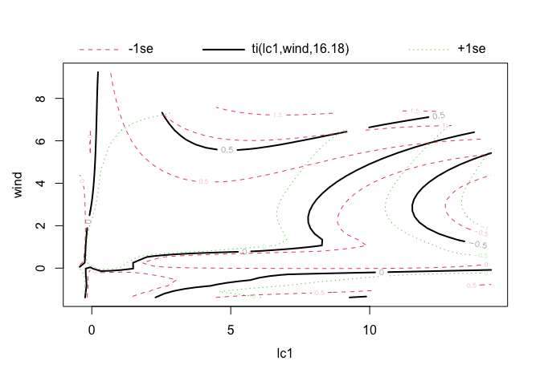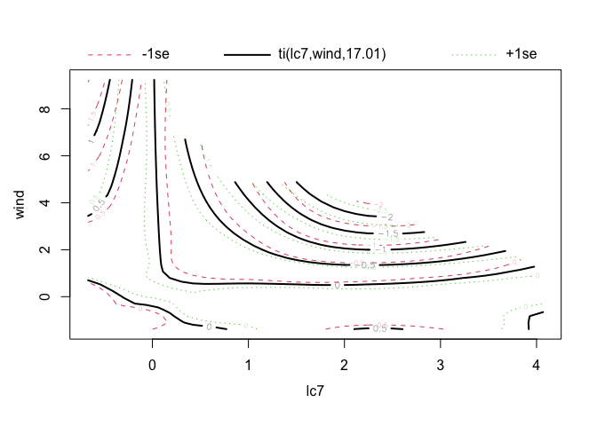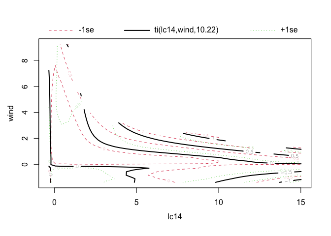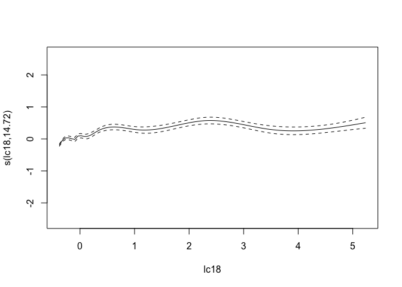

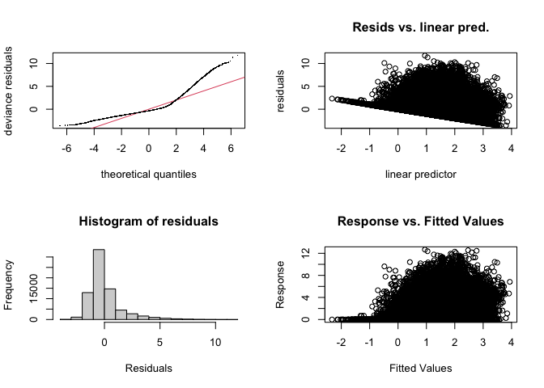

```
## 
## Method: fREML   Optimizer: perf newton
## full convergence after 17 iterations.
## Gradient range [-1.065513e-05,5.274895e-06]
## (score 134343.2 & scale 2.229081).
## Hessian positive definite, eigenvalue range [0.2460183,36774.57].
## Model rank =  792 / 792 
## 
## Basis dimension (k) checking results. Low p-value (k-index<1) may
## indicate that k is too low, especially if edf is close to k'.
## 
##                   k'    edf k-index p-value    
## s(lon,lat)     99.00  93.38    0.93  <2e-16 ***
## s(area)        11.00   7.34    1.00   0.655    
## s(altiMean)    19.00  18.19    0.96   0.005 ** 
## s(wind)        11.00   2.16    0.99   0.320    
## s(RH)          11.00   7.83    1.00   0.340    
## s(clim4)        5.00   4.05    0.99   0.290    
## ti(lc11,wind) 121.00  19.30    1.00   0.420    
## ti(lc12,wind) 121.00  19.11    0.99   0.290    
## ti(lc1,wind)  121.00  16.18    1.00   0.580    
## ti(lc7,wind)  121.00  17.01    1.00   0.370    
## ti(lc14,wind) 121.00  10.22    1.00   0.535    
## s(lc18)        29.00  14.72    0.97   0.010 ** 
## ---
## Signif. codes:  0 '***' 0.001 '**' 0.01 '*' 0.05 '.' 0.1 ' ' 1
```

## Speeding previous RF model

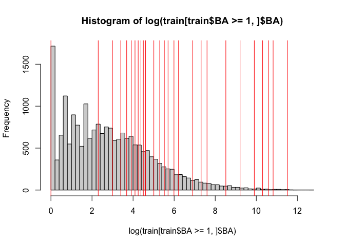


```
## 
## Call:
##  randomForest(formula = as.factor(I(BA >= 1)) ~ . - CNT - clim1 -      clim2, data = train) 
##                Type of random forest: classification
##                      Number of trees: 500
## No. of variables tried at each split: 5
## 
##         OOB estimate of  error rate: 15.33%
## Confusion matrix:
##       FALSE  TRUE class.error
## FALSE 49503  3482  0.06571671
## TRUE   7795 12783  0.37880260
```


```
## 
## Family: gaussian 
## Link function: identity 
## 
## Formula:
## log(BA) ~ -1 + year + month + s(lon, lat, bs = "gp", k = 100) + 
##     s(area, bs = "cr", k = 12) + s(altiMean, bs = "cr", k = 20) + 
##     s(wind, bs = "cr", k = 12) + s(RH, bs = "cr", k = 12) + s(clim4, 
##     bs = "cc", k = 7) + ti(lc11, wind, k = 12) + ti(lc12, wind, 
##     k = 12) + ti(lc1, wind, k = 12) + ti(lc7, wind, k = 12) + 
##     ti(lc14, wind, k = 12) + s(lc18, bs = "cr", k = 12)
## 
## Parametric coefficients:
##        Estimate Std. Error t value Pr(>|t|)    
## year  1.394e-03  3.651e-05  38.166   <2e-16 ***
## month 5.384e-03  1.190e-02   0.452    0.651    
## ---
## Signif. codes:  0 '***' 0.001 '**' 0.01 '*' 0.05 '.' 0.1 ' ' 1
## 
## Approximate significance of smooth terms:
##                  edf Ref.df       F  p-value    
## s(lon,lat)    85.395 93.591  18.329  < 2e-16 ***
## s(area)        3.120  3.868  10.175  < 2e-16 ***
## s(altiMean)    5.304  6.621   7.412  < 2e-16 ***
## s(wind)        1.001  1.002  17.174 3.43e-05 ***
## s(RH)          2.809  3.604 468.202  < 2e-16 ***
## s(clim4)       4.311  5.000  48.695  < 2e-16 ***
## ti(lc11,wind) 14.436 18.656   2.936 1.99e-05 ***
## ti(lc12,wind)  6.351  8.807   1.404   0.1807    
## ti(lc1,wind)   9.443 12.214   4.123 4.12e-06 ***
## ti(lc7,wind)  16.542 21.466   4.393  < 2e-16 ***
## ti(lc14,wind)  4.585  6.503   2.337   0.0234 *  
## s(lc18)        1.991  2.354   9.659 2.31e-05 ***
## ---
## Signif. codes:  0 '***' 0.001 '**' 0.01 '*' 0.05 '.' 0.1 ' ' 1
## 
## R-sq.(adj) =  0.178   Deviance explained = 18.4%
## fREML =  42745  Scale est. = 3.6415    n = 20578
```

```
## S_BA = 4274
```

```
## 
## 
## Time to fit the model : 1.977
```

## Generalized Boosted Regression on log(BA+1)


```
## Using 500 trees...
```

```
## S_BA = 3430
```

```
## 
## 
## Time to fit the model : 6.155
```

## GBM on log(BA+1) improvement :


```
## Using 498 trees...
```

```
## Using 500 trees...
```

```
## S_BA = 3173
```

```
## 
## 
## Time to fit the model : 12.322
```


